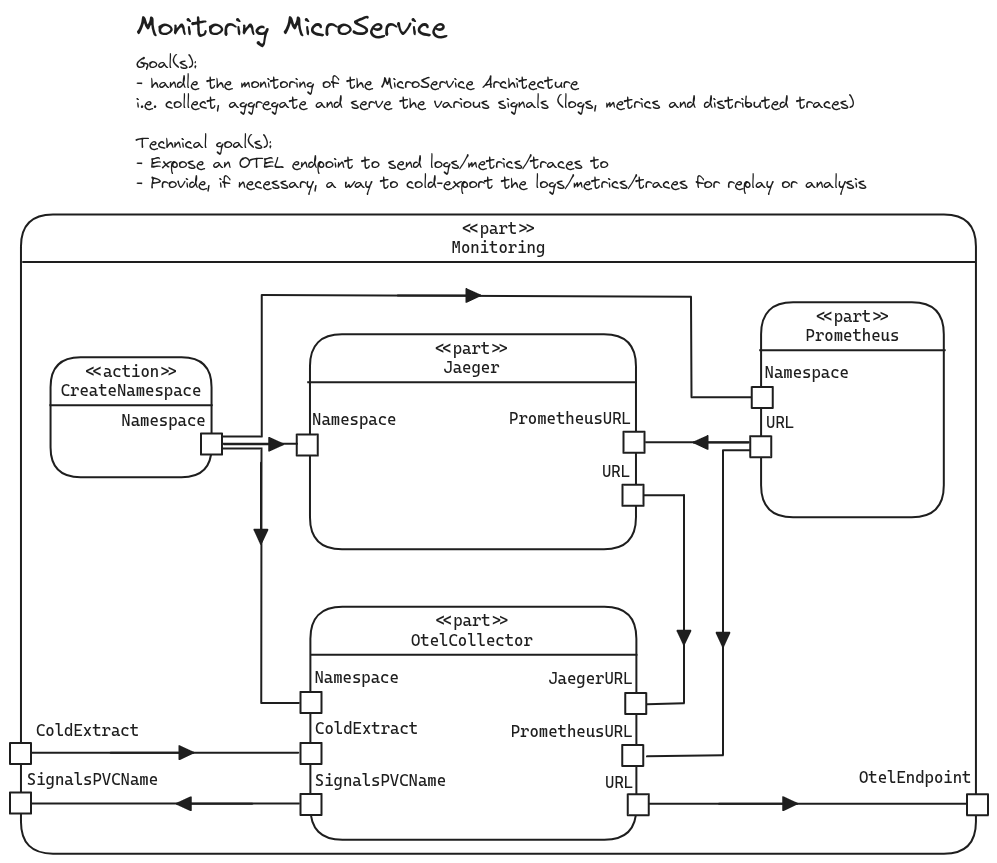

# Monitoring

The _Monitoring_ component is in charge of the collection, process and storage of various signals (i.e. logs, metrics and distributed traces).
It is extensively based upon [OpenTelemetry](https://opentelemetry.io/), with its [Collector](https://github.com/open-telemetry/opentelemetry-collector).

> [!CAUTION]
>
> This component is an **internal** work mostly used for development purposes.
> It is used for production purposes too, i.e. on Capture The Flag events.
>
> Nonetheless, **we do not include it in the repositories we are actively maintaining**.

## Architecture

The component's architecture currently provides:
- [OpenTelemetry Collector](https://opentelemetry.io/docs/collector/)
- [Jaeger UI](https://www.jaegertracing.io/)
- [Prometheus](https://prometheus.io/)

The multiple services passes information in a non-cyclic way to avoid deadlocks (DAG or dependencies), as summarized in the following diagram.

<div align="center">
    
</div>

## Cold Extract

For research and/or development purposes, the architecture provide way to perform an extraction of the OpenTelemetry data.

1. Activate cold extract
  ```bash
  pulumi config set cold-extract true
  ```

## TODO list

- Add Grafana (require Prometheus)
- Add AlertManager (require Prometheus)
- Think of Dashboard as Code, and if it is relevant to extract them (so technically how ? With Docker manifests inspection ? Service discovery and custom protocol ?) automatically ?
