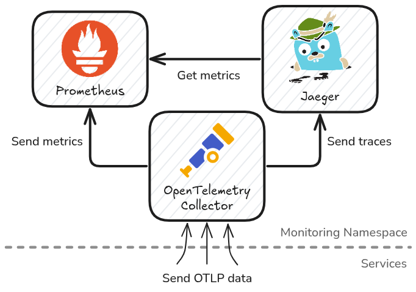

<div align="center">
  <h1>Monitoring</h1>
  <a href="https://pkg.go.dev/github.com/ctfer-io/monitoring"></a>
  <a href="https://goreportcard.com/report/github.com/ctfer-io/monitoring"></a>
  <a href="https://coveralls.io/github/ctfer-io/monitoring?branch=main"></a>
  <br>
  <a href=""></a>
  <a href="https://github.com/ctfer-io/monitoring/actions?query=workflow%3Aci+"></a>
  <a href="https://github.com/ctfer-io/monitoring/actions/workflows/codeql-analysis.yaml"></a>
  <br>
  <a href="https://securityscorecards.dev/viewer/?uri=github.com/ctfer-io/monitoring"></a>
</div>

The _Monitoring_ component is in charge of the collection, process and storage of various signals (i.e. logs, metrics and distributed traces).
It is extensively based upon [OpenTelemetry](https://opentelemetry.io/), with its [Collector](https://github.com/open-telemetry/opentelemetry-collector).

> [!CAUTION]
>
> This component is an **internal** work mostly used for development purposes.
> It is used for production purposes too, i.e. on Capture The Flag events.
>
> Nonetheless, **we do not include it in the repositories we are actively maintaining**.

## Architecture

The Monitoring service's architecture currently provides:
- [OpenTelemetry Collector](https://opentelemetry.io/docs/collector/)
- [Jaeger UI](https://www.jaegertracing.io/)
- [Prometheus](https://prometheus.io/)
- [Perses](https://perses.dev/)

The multiple parts passes information in a non-cyclic way to avoid deadlocks (DAG or dependencies), as summarized in the following diagram.

<div align="center">
    
</div>

## Cold Extract

For research and/or development purposes, the architecture provide way to perform an extraction of the OpenTelemetry data.

1. Activate cold extract:
  ```bash
  pulumi config set cold-extract true
  ```

2. Use the Monitoring through the OTEL Collector endpoint.

3. Run the extractor:
  ```bash
  mkdir extract
  go run cmd/extractor/main.go \
    --namespace $(pulumi stack export namespace) \
    --pvc-name $(pulumi stack export otel-cold-extract-pvc-name) \
    --directory extract
  ```

## TODO list

- Add AlertManager (require Prometheus)
- Add ElasticSearch/OpenSearch for logs and/or storage backend for traces
